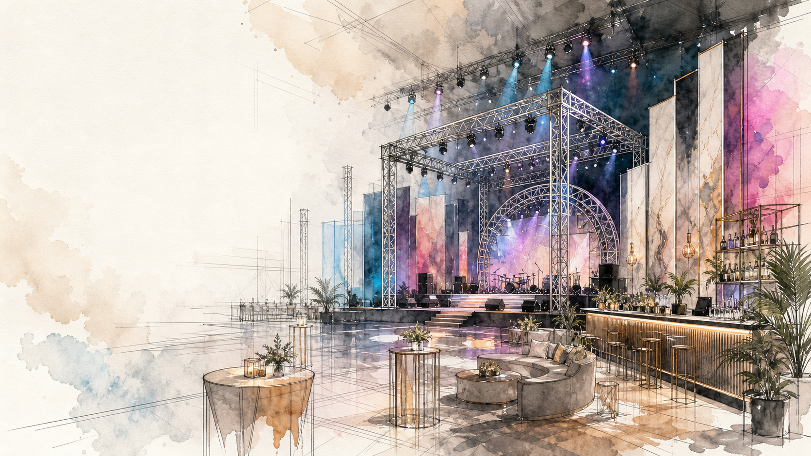
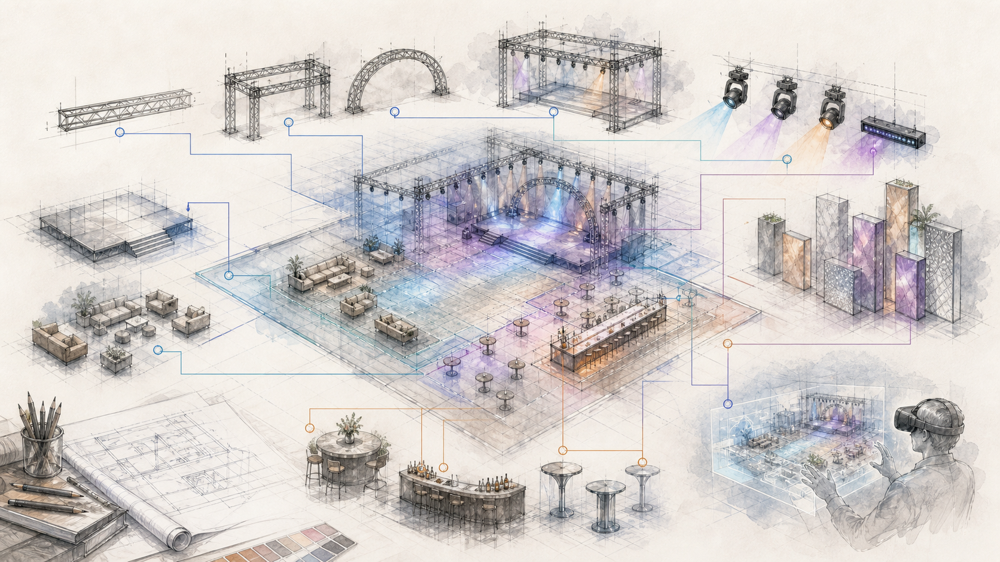
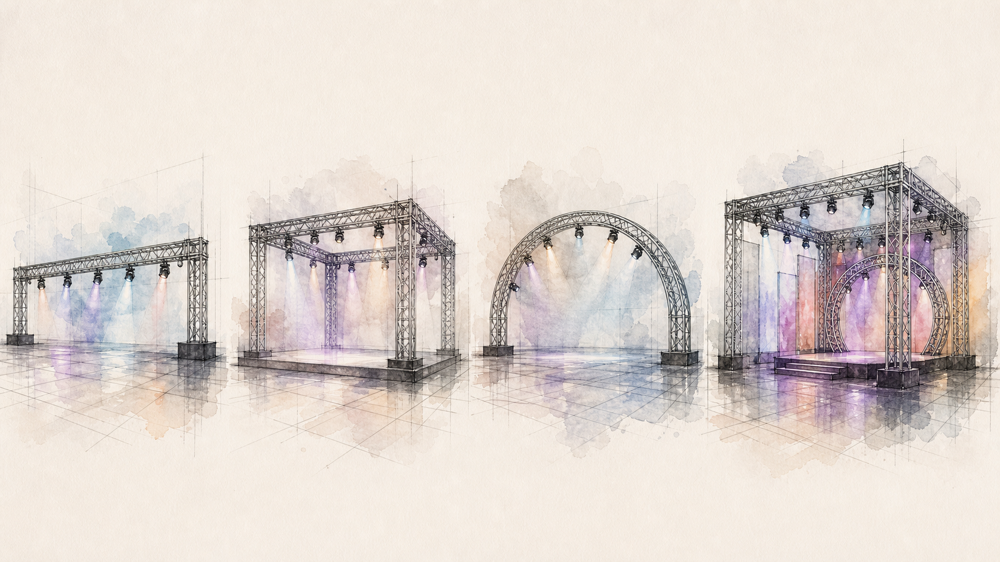
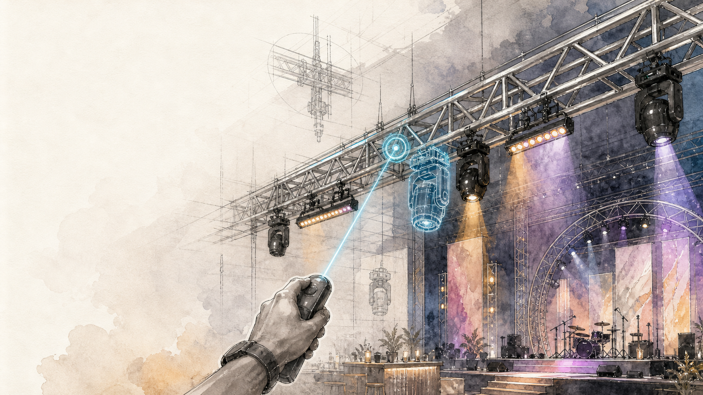
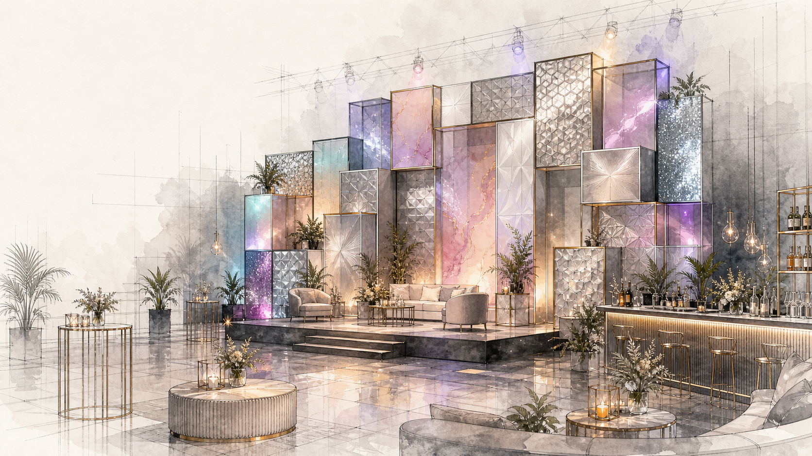

  

<h1 align="center">Unreal Truss</h1>

  <strong>Live-event build tools for Unreal Engine</strong> 
  A runtime-first toolkit for designing truss, stages, lighting, scenic walls, decor, bars, tables, and complete event setups.

  
  
  
  

---

<table>
  <tr>
    <td width="50%">
      <h2>Build The Room Before The Doors Open</h2>
      

        Unreal Truss is growing into a live-event layout and previsualization toolkit:
        a way to place the physical pieces of an event inside Unreal before the crew is on site.
      

      

        The first foundation is truss built from real inventory lengths. From there, the same runtime
        placement system can expand into stages, scenic walls, lighting fixtures, decor, bars, tables,
        and future VR editing workflows.
      

    </td>
    <td width="50%">
      
    </td>
  </tr>
</table>

## Mission

Unreal Truss started as a runtime-first Unreal Engine 5.6 plugin for building event-production truss structures from real inventory lengths. The larger direction is a reusable live-event build toolkit: a shared runtime foundation for truss, stages, decor items, bars, tables, MBP scenic walls, lighting fixtures, and future VR placement/editing workflows.

The first milestone is a straight truss run. The plugin keeps the truss math in runtime C++ so the same system can be used later by editor tools, Blueprint gameplay, in-game UI, and immersive event layout tools.

Core goals:

- Build event structures from real inventory sizes and reusable data.
- Keep generation logic in runtime C++ so editor, desktop runtime, Blueprint UI, and VR can share it.
- Make placement and editing feel fast enough for real event-design iteration.
- Use instanced mesh output where repeated gear would otherwise become expensive.
- Grow from truss into complete live-event environments.

## What It Builds

<table>
  <tr>
    <th>System</th>
    <th>Current Direction</th>
    <th>Status</th>
  </tr>
  <tr>
    <td><strong>Truss</strong></td>
    <td>Straight runs, rectangles, arches, cubes, cube arches, real inventory lengths, mounted fixtures.</td>
    <td>Runtime actor and editor/runtime workflows started.</td>
  </tr>
  <tr>
    <td><strong>Lighting</strong></td>
    <td>Fixture selection, over/under-slung placement, truss-owned mounted fixture definitions.</td>
    <td>First runtime and editor placement pass started.</td>
  </tr>
  <tr>
    <td><strong>MBP Walls</strong></td>
    <td>3 ft x 3 ft modular panel grids, mixed styles, shimmer materials, custom slots, depth offsets.</td>
    <td>Editor-first wall actor started in the runtime plugin.</td>
  </tr>
  <tr>
    <td><strong>Stages</strong></td>
    <td>Deck/cell-based stage layout with per-section heights, automatic skirt generation, podium support, and later runtime placement.</td>
    <td>Editor-first stage actor started.</td>
  </tr>
  <tr>
    <td><strong>Pipe And Drape</strong></td>
    <td>Freeform drape runs using bases, telescoping uprights, adjustable 7-12 ft crossbars, static drape cloth, and optional future cloth/sway modes.</td>
    <td>Editor and runtime create/edit workflow started.</td>
  </tr>
  <tr>
    <td><strong>Decor, Bars, Tables</strong></td>
    <td>Venue-ready build items that use the same preview, placement, editing, and save/load direction.</td>
    <td>Planned expansion.</td>
  </tr>
</table>

## System Direction

<table>
  <tr>
    <td align="center"><strong>1. Select</strong> Choose a build item such as truss, wall, stage, bar, table, or decor.</td>
    <td align="center"><strong>2. Preview</strong> Use a lightweight actor and shared targeting pointer to place it in the world.</td>
    <td align="center"><strong>3. Configure</strong> Adjust dimensions, modes, inventory pieces, panel styles, or fixture options.</td>
    <td align="center"><strong>4. Place</strong> Commit the item into the Unreal scene using runtime build definitions.</td>
    <td align="center"><strong>5. Edit</strong> Reload the same data model and rebuild in place as the design changes.</td>
  </tr>
</table>

## Truss Modes

  

The first buildable system covers straight truss runs, rectangle structures, arches, cubes, and cube arch structures. Truss pieces are selected from inventory lengths and rendered through instanced static mesh components when meshes are assigned.

## Fixture Placement

<table>
  <tr>
    <td width="50%">
      
    </td>
    <td width="50%">
      <h2>Target The Rail, Keep The Data</h2>
      

        Runtime light placement writes back to <code>ATrussStructureActor</code> mounted-fixture definitions instead of leaving loose actors behind.
        Editor-placed and runtime-placed lights can share the same truss-owned data model.
      

      

        The current pass supports over-slung and under-slung fixture placement with named rails and span-aware mounting for more complex structures.
      

    </td>
  </tr>
</table>

## Scenic And Decor Systems

  

MBP wall generation is the first scenic system beyond truss. It uses mixed per-slot styles, blank slots, custom mesh slots, shimmer materials, depth offsets snapped in 12-inch steps, and instanced rendering by mesh/material bucket. Stage decks, decor placement, bars, tables, and other live-event items can follow the same runtime build framework.

## Runtime Principles

| Area | Direction |
| --- | --- |
| Runtime-first architecture | Keep generation and placement logic in `MajicTrussRuntime` so editor tools, gameplay UI, desktop runtime, and future VR can share the same systems. |
| Real event inventory | Build from real truss lengths and imported event gear instead of abstract placeholder dimensions. |
| Unified placement | Use shared build definitions, preview actors, targeting pointers, and update paths for creating and editing placed items. |
| Low-overhead output | Favor instanced mesh components and data-driven actors so generated event layouts stay practical. |
| Expandable live-event scope | Treat truss as the first buildable item, then grow into stages, walls, lighting, decor, bars, tables, and complete event setups. |

## Roadmap

1. Validate drape runtime placement/editing in a real room layout and decide whether the short-span drape offset needs another calibration pass.
2. Revisit Chaos cloth with a clean pre-authored drape skeletal mesh and simple pinned top edge.
3. Validate final Y-run truss fixture alignment on rectangle and cube structures.
4. Improve MBP authoring with easier slot editing, pattern helpers, and mixed-style presets.
5. Improve stage deck authoring, podium integration, and runtime placement/editing.
6. Add the next venue gear tool, likely TV/display stands or speaker stands.
7. Add decor, bars, tables, and other venue-ready build items.
8. Add VR as a new input layer with controller-ray targeting and world-space UI.

## Repository Map

| Path | Purpose |
| --- | --- |
| `Plugins/MajicTruss/Source/MajicTrussRuntime` | Runtime plugin with truss generation, build placement support, fixture mounting, MBP wall generation, stage deck generation, and pipe-and-drape generation. |
| `Source/UnrealTruss` | Code-first playable test path, build menu widget, light placement menu, targeting pointer, pawn, and game mode. |
| `Content/Build` | Build item data assets used by the runtime placement workflow. |
| `Content/Majic_Gear` | Imported truss, MBP, lighting, and event-gear assets used by the current tool pass. |
| `docs` | Supporting notes and project-page assets. |

## Project Log

<strong>2026-05-11: Runtime pipe-and-drape placement and editing</strong>

### 2026-05-11

Current direction:

- Keep the static drape/hardware path as the reliable default.
- Keep Chaos cloth as an optional experiment until a clean pre-authored cloth asset is stable.
- Use the same runtime build menu and pointer selection model as truss, MBP, and stage so drape does not become a one-off tool.

What has been done:

- Added `DrapeRun` as a shared build item type.
- Added `FDrapeRunBuildDefinition` support to `UBuildItemDataAsset` and `UBuildManagerComponent`.
- Added a `Drape` tab to the runtime build menu.
- Added runtime drape controls:
  - `Length (ft)`
  - `Height (ft)`
- Added fallback runtime drape build item creation when no saved drape build asset exists.
- Runtime drape preview and placement now spawn `ADrapeRunActor` and apply the active drape definition.
- Added runtime drape editing using the same pointer workflow:
  - look at a drape line and press `E`
  - click the highlighted drape line
  - edit length and height in the `Edit Drape` menu
  - apply changes directly to the selected drape actor
- Added selection/highlight cleanup so drape edit mode cancels and closes consistently with other build systems.
- Added a generated-component Nanite safeguard for drape static mesh components by setting `bDisallowNanite`, which avoids warnings when imported meshes use the USD `DisplayColor` material without Nanite usage flags.
- Added a simple Chaos cloth checkbox/path, but static mesh mode remains the expected working mode.
- Added an OBJ source reference for the Chaos test drape panel at `Content/Majic_Gear/Drape/Chaos_Test_Drape/Source/Chaos_Test_Drape.obj`.

Notes:

- Current drape hardware calibration is good enough to use:
  - `CrossbarPlacementOffsetCm.X = 317`
  - `OutsideRodSpanAdjustmentCm = 49`
  - `DrapePlacementOffsetCm = (150, 0.1, 242)`
  - `DrapeTopAnchorLocalZCm = 486`
- The drape width scaling is acceptable for now, but very short crossbar spans may still need minor horizontal offset tuning later.
- Cloth painting on reduced skeletal drape meshes produced unstable/random triangle simulation, so the next cloth pass should start from clean topology and a simple pre-authored cloth asset.

Possible next tools:

- TV/display stands on Altman bases and black pipe, with selectable screen sizes and trim heights.
- Speaker stands, with tripod or crank-stand variants and common speaker sizes.
- Projection screen kits as runtime build items, reusing the existing screen assets and drape/skirt ideas.

<strong>2026-05-08: Editor-first pipe-and-drape run actor</strong>

### 2026-05-08

Current direction:

- Keep `ADrapeRunActor` editor-first until the physical pipe-and-drape model is stable.
- Use the new shared-origin drape assets in `Content/Majic_Gear/Drape` instead of the older combined section imports.
- Treat Chaos cloth as the next experiment after the static/hardware actor is reliable.

What has been done:

- Added first-pass `ADrapeRunActor` in `MajicTrussRuntime`.
- Added freeform drape run controls:
  - `Length (ft)`
  - `Height (ft)`
  - automatic section calculation from 7-12 ft crossbars
  - hardware and drape visibility toggles
- Added automatic pole-kit selection:
  - 72 inch pole kit for heights up to 120 in
  - 96 inch pole kit for heights up to 144 in
  - 120 inch pole kit for taller runs
- Reworked the crossbar as a telescoping kit:
  - inside rod group stays fixed by default
  - outside rod group slides as the section span changes
  - current calibrated defaults:
    - `CrossbarPlacementOffsetCm.X = 317`
    - `OutsideRodSpanAdjustmentCm = 49`
- Added inside-upright calibration by pole kit:
  - `Inside72InchPoleCalibrationOffsetCm = 58`
  - `Inside96InchPoleCalibrationOffsetCm = 89`
  - `Inside120InchPoleCalibrationOffsetCm = 0`
- Added static drape generation with material override and calibrated placement:
  - `DrapePlacementOffsetCm = (150, 0.1, 242)`
  - `DrapeScale = (1, 1, 0.5)`
  - `DrapeTopAnchorLocalZCm = 486`
- Added switches for static mesh, Chaos cloth, and material-sway drape modes. Static mesh mode is the currently calibrated path.

Notes:

- The drape width scaling is close enough for now, but shorter-than-12-ft sections can still show minor horizontal drift because the drape mesh scales around its own origin.
- The next likely pass is Chaos cloth using a pre-authored cloth-capable drape panel, not runtime creation of brand-new cloth assets.
- Runtime placement/menu integration should wait until the editor actor has had more use in real layouts.

<strong>2026-05-05: Stage railing pass and updated podium integration</strong>

### 2026-05-05

Current direction:

- Keep pushing the stage actor toward the same runtime-ready pattern as truss and MBP.
- Use the corrected `Single_Decks`, `Updated_Podiums`, and now `Railing` kits as the real asset base instead of old scale-corrected imports.
- Add stage steps and finish the editor-side perimeter workflow before moving the stage into the runtime build menu.

What has been done:

- Switched podium lookup from the older `Stage/Podiums` content to the new assembled `Stage/Updated_Podiums` folders.
- Updated podium placement to use the same shared-anchor kit logic as the new deck assets instead of re-centering each mesh part from its own bounds.
- Added first-pass stage railing support to `AStageDeckActor`.
- Added side toggles for railing generation:
  - `Enable Front Railing`
  - `Enable Back Railing`
  - `Enable Left Railing`
  - `Enable Right Railing`
- Added perimeter run detection for railing using the same exposed-edge concept as stage skirt.
- Added span packing for railing runs:
  - use as many `94 inch` rail spans as possible
  - fill remaining valid run length with `46 inch` spans
- Added shared railing transform controls:
  - `Railing Placement Offset Cm`
  - `Railing Placement Rotation`
- Added span-specific adjustment controls for later packing calibration:
  - `Railing94SpanAdjustmentCm`
  - `Railing46SpanAdjustmentCm`
- Reworked railing placement around a cleaner calibration model:
  - per-side offsets own side alignment
  - deck-height changes use separate preset height adjustments
  - mixed-height edges split into separate railing runs per height preset
- Updated the final side alignment defaults used by the current stage pass:
  - `Front Railing Offset Cm = (249.338089, -61.650452, 0.0)`
  - `Back Railing Offset Cm = (0.0, 62.298616, 0.0)`
  - `Left Railing Offset Cm = (189.700066, 120.653588, 0.0)`
  - `Right Railing Offset Cm = (58.727953, -121.189095, 0.0)`
- Locked in runtime/editor height adjustment fields based on measured imported step/deck alignment:
  - `RailingHeightAdjust8Cm = 0.0`
  - `RailingHeightAdjust12Cm = 11.0`
  - `RailingHeightAdjust24Cm = 32.0`
  - `RailingHeightAdjust27Cm = 55.5`
- Added construction-time migration logic so older placed stage actors can move from the earlier baked rail-height defaults to the new reference-height model.
- Added first-pass stage step support using the `Stageright_Steps` kits:
  - `Stageright_2_Step` for `12 inch`
  - `Stageright_3_Step` for `24 inch`
  - `Stageright_4_Step` for `27 inch`
  - no step for `8 inch`
- Added step controls:
  - `Enable Left Step`
  - `Enable Right Step`
  - `LeftStepOffsetCm`
  - `RightStepOffsetCm`
  - `LeftStepRotation`
  - `RightStepRotation`
- Locked in current step placement defaults:
  - `LeftStepOffsetCm = (0.0, -123.745361, 0.0)`
  - `LeftStepRotation = (0, 0, 90 display axis)`
  - `RightStepOffsetCm = (244.693954, 0.0, 0.0)`
  - `RightStepRotation = (0, 0, -90 display axis)`
- Reworked left/right side railing generation so a placed step shortens that side’s railing run by one deck cell at the back instead of trying to hide the railing after generation.
- Fixed stage default height editing so changing `Default Height Preset` now pushes the new preset across the deck cells and rebuilds immediately.
- Added first-pass runtime stage build support to the shared build flow:
  - `EBuildItemType::StageDeck`
  - `FStageDeckBuildDefinition`
  - build-manager application for preview and spawn
  - fallback runtime stage build item creation when no saved stage build asset exists
- Added a new `Stage` tab to the runtime `BuildMenuWidget`.
- Added first-pass runtime stage controls:
  - columns
  - rows
  - deck height preset
  - surface style
  - front/back/left/right railing toggles
  - left/right step toggles
- Added `AStageDeckActor::ApplyBuildDefinition(...)` so runtime preview and final placement use the same stage-grid setup path.
- Added first-pass runtime stage editing using the same `E` -> point -> click-to-edit pattern as MBP:
  - look at a stage actor and press `E`
  - click a specific stage cell
  - open the `Stage` tab in edit mode
- Added runtime stage edit scopes:
  - `Whole Stage`
  - `Cell`
- Added first-pass stage edit operations:
  - whole-stage rows and columns
  - whole-stage default height and surface
  - whole-stage railings, steps, and automatic skirt toggles
  - per-cell enabled state
  - per-cell height preset
  - per-cell surface style
- Added direct stage runtime edit helpers on `AStageDeckActor`:
  - `GetCellDefinition(...)`
  - `ApplyCellDefinition(...)`
- Fixed a PIE/runtime stage bug where transient default-cache state could cause serialized per-cell stage edits to get replaced by defaults on first reconstruction.
- Fixed a stage rebuild cleanup bug where old railing and step instance buckets were not being cleared, which caused duplicate railings and duplicated back steps after live stage edits.

Immediate next steps:

- Start a first-pass drape runtime system.
- Evaluate whether the existing drape assets are good enough as-is or whether they should be rebuilt like today’s stage assets.
- Decide whether cloth behavior should be:
  - a lightweight optional effect for hero drape only
  - or a static/non-cloth default for most runtime drape runs

Notes for the next session:

- The stage actor now has three major perimeter systems in flight:
  - skirt
  - railing
  - steps
- The stage perimeter model is now clearer:
  - side alignment offsets
  - preset height adjustments
  - side steps that shorten railing runs
- Runtime stage placement and first-pass runtime stage editing are both now in the shared build menu flow.
- Drape is the next likely runtime scenic system. The likely target model is a run-based system using bases, uprights, crossbars, and optional cloth behavior for the drape itself.

<strong>2026-05-04: Stage deck actor, single-deck kits, and calibrated stage skirt pass</strong>

### 2026-05-04

Current direction:

- Keep the stage system following the same pattern as MBP:
  - editor-first authoring
  - runtime-plugin core actor
  - data model that can later be reused in the runtime build menu
- Treat stage decks as a cell/grid system instead of a rectangle-only array so irregular shapes, peninsulas, and mixed deck heights remain possible.
- Keep the current stage pass focused on practical editor layout first, then wire it into runtime after the authoring workflow is less manual.

What has been done:

- Added first-pass `AStageDeckActor` in the runtime plugin.
- Stage actor now supports:
  - `Rows`
  - `Columns`
  - per-cell enabled/disabled state
  - per-cell deck height presets:
    - `8 inch`
    - `12 inch`
    - `24 inch`
    - `27 inch`
  - per-cell surface style
  - row/column batch editing
  - optional podium selection with offsets
- Confirmed the original deck imports were not a good long-term base because they required correction scaling/rotation.
- Switched the stage system to the new assembled `Single_Decks` content:
  - `Single_8_inch_Stage_Deck`
  - `Single_12_inch_Stage_Deck`
  - `Single_24_inch_Stage_Deck`
  - `Single_27_inch_Stage_Deck`
- Updated deck generation so each stage cell now spawns the whole static-mesh kit from the chosen `Single_Decks/.../StaticMeshes` folder at a shared anchor instead of trying to normalize each part from its own bounds.
- Moved stage surface handling toward the same pattern used for shimmer panels:
  - keep the full deck kit
  - treat the `Carpet` mesh as the surface target
  - allow material override there instead of deleting pieces to fake style
- Added debug deck placement controls:
  - `Deck Placement Offset Cm`
  - `Deck Placement Rotation`
- Confirmed podium assets need to be re-authored before they are worth spending more placement time on because the current podium imports are still coming in at an undesirable scale.
- Replaced the stage skirt experiment that used skeletal drape logic with the top-level static mesh `StageDrape` asset.
- Built a debug single-skirt calibration path on the stage actor, then used it to dial in stage skirt placement against the front-right reference edge.
- Locked in the current debug skirt defaults:
  - `Debug Skirt Offset Cm = (123.166338, -65.886528, 5.024358)`
  - `Debug Skirt Scale = (1.05, 0.25, 1.0)`
  - `Skirt Height Scale 27 Inch = 1.185277`
- Reapplied that calibrated debug skirt setup back into automatic perimeter skirt generation.
- Added per-edge automatic skirt adjustment controls:
  - `AutoSkirtFrontAdjustmentCm`
  - `AutoSkirtBackAdjustmentCm`
  - `AutoSkirtLeftAdjustmentCm`
  - `AutoSkirtRightAdjustmentCm`
- Locked in the latest known-good left/right defaults from the current tuning pass:
  - `AutoSkirtLeftAdjustmentCm = (0.0, 124.419191, 0.0)`
  - `AutoSkirtRightAdjustmentCm = (-125.676275, 3.194805, 0.0)`
- Added editor-facing cell labels so the actor can show the same linear indexing used in the `Deck Cells` array:
  - `Index 0`
  - `Index 1`
  - etc.
- Added cell-label controls:
  - `Show Cell Labels`
  - `Cell Label Height Cm`
- Cell labels now show for enabled and disabled cells, with disabled cells rendered in red to make shape editing less blind.

Immediate next steps:

- Validate the current automatic skirt pass with the latest left/right per-edge defaults.
- Improve stage cell authoring so irregular shapes are faster to create than editing the raw `Deck Cells` array one item at a time.
- Rebuild podium assets so they can be used without scale hacks.
- After podium assets are corrected, finish podium placement/options on the stage actor.
- Once the editor workflow feels solid, bring `AStageDeckActor` into the shared runtime build menu flow the same way truss and MBP were integrated.

Notes for tomorrow:

- The stage system is in a usable editor-first state, but still in calibration mode for skirt edges and deck authoring ergonomics.
- The new `Single_Decks` assets are the right base going forward; do not fall back to the older corrected one-mesh deck setup.
- Podiums should wait for the new asset versions instead of adding more code-side scale workarounds now.
- The next quality-of-life gain is better cell toggling and editing, not more rendering refactors.

<strong>2026-04-29: MBP, mounted fixtures, and reusable event-build direction</strong>

### 2026-04-29

Current direction:

- Keep pushing toward a reusable event-build tool instead of a truss-only prototype.
- Keep generation/runtime logic in the runtime plugin so editor, desktop runtime, and later VR can share the same core systems.
- Build MBP as the next major modular system, starting editor-first but keeping the data model runtime-ready.

What has been done:

- Expanded editor-mounted truss fixture workflow beyond the original single-span assumption.
- Added named rail selection for editor-mounted fixtures:
  - `Left Top`
  - `Right Top`
  - `Left Bottom`
  - `Right Bottom`
- Added explicit horizontal span selection for multi-run structures:
  - `Main Span`
  - `Front X Run`
  - `Back X Run`
  - `Left Y Run`
  - `Right Y Run`
- Updated mounted fixture rebuild behavior so top/bottom fixture height follows the current truss span height instead of full-structure floor bounds.
- Improved rectangle/cube light placement logic to distinguish X runs and Y runs rather than treating the whole structure as one horizontal mount area.
- Added a pragmatic Y-run mount correction field on the truss actor:
  - `Y Run Mount X Adjustment Cm`
- Added first-pass MBP wall builder actor in the runtime plugin:
  - `AMBPWallActor`
  - mixed per-slot styles
  - blank slots
  - custom mesh slots for signs or one-off centerpieces
  - per-slot depth offset snapped in 12-inch steps
  - row/column batch editing
  - instanced rendering by mesh/material bucket
- Reworked MBP content integration to use the newer assembled segment folders instead of the original single-mesh segment assets:
  - `Acrylic`
  - `Drift`
  - `Geo`
  - `Shimmer`
  - `Hive`
  - `Platinum`
- Added automatic `Extra_Frame` segment support when an MBP panel has non-zero depth offset.
- Reworked shimmer so it is material-driven per slot:
  - direct `Shimmer Material` asset reference on the slot
  - generated `30 x 30` plane array for the shimmer face
  - retained frame structure from the imported shimmer segment kit
- Added shimmer face tuning controls and locked in the current aligned defaults:
  - `Shimmer Face Offset X Cm = -1.902981`
  - `Shimmer Face Offset Y Cm = -0.104`
  - `Shimmer Face Offset Z Cm = -4.650027`
- Fixed editor rebuild stability for MBP by reusing generated instanced mesh components instead of destroying/recreating them on every reconstruction.
- Confirmed the current MBP wall assumption is a 3 ft x 3 ft panel grid with future support needed for deeper pattern tooling and runtime placement.
- Confirmed the current architecture should support later VR work without rewriting truss/MBP generation, as long as VR is added as a new input/targeting/UI layer.

Immediate next steps:

- Validate the final Y-run truss fixture alignment on rectangle and cube using the editable correction field.
- Keep `AMBPWallActor` as the shared wall definition actor and begin exposing it through the same runtime build framework used by truss.
- Add MBP as a runtime buildable item:
  - runtime preview actor
  - runtime placement flow
  - reuse of the same slot/grid data model
- Improve `AMBPWallActor` editor workflow further:
  - easier slot editing
  - pattern helpers
  - better default authoring flow for mixed-style walls
- Extend MBP later with:
  - per-panel forward/back offsets
  - faster pattern editing
  - mixed-style wall presets
- Decide whether row/column edits should remain one-shot batch actions or become persistent row/column override layers.
- Revisit stage deck building after MBP is stable.
- Keep VR as a later integration target:
  - new VR pawn/controller
  - controller-ray targeting
  - world-space UI
  - reuse existing build actors/data definitions

Notes for future sessions:

- `GeneratedBounds` is still fine for selection/highlight, but truss fixture placement on complex structures may need span-specific bounds or explicit corrections instead of whole-structure assumptions.
- MBP should stay data-driven from day one so editor authoring, desktop runtime placement, and later VR can all hit the same wall definition.
- Do not bury too much wall-authoring logic in one-off editor utilities if the same wall data will later be placed at runtime.

<strong>2026-04-27: Runtime build framework and first truss workflow</strong>

### 2026-04-27

Current direction:

- Treat truss as the first buildable item, not the only buildable item.
- Build a lightweight runtime building framework first, then plug truss into it.
- Keep the system low-overhead so it can run on weaker hardware.

What has been done:

- Confirmed the truss generator already lives in the runtime plugin `MajicTrussRuntime`.
- Reviewed the current runtime actor `ATrussStructureActor` and the truss math/inventory code.
- Confirmed GitHub backup remote is `https://github.com/CarlMajic/unreal-truss.git`.
- Added first-pass runtime building framework classes:
  - `UBuildItemDataAsset` for data-driven buildable items
  - `UBuildManagerComponent` for runtime build mode, tracing, preview movement, rotation, and placement
  - `ABuildPreviewActor` for lightweight in-world preview handling
- Added `FTrussBuildDefinition` plus `ApplyBuildDefinition`, `GetBuildDefinition`, and `BuildCurrentMode` on `ATrussStructureActor` so truss can be configured and built at runtime through a generic placement flow.
- Added a code-first playable test setup in the game module:
- Added a code-first playable test setup in the game module:
  - `AUnrealTrussBuildPawn`
  - `AUnrealTrussGameMode`
- Configured project defaults so Play mode uses the C++ game mode and build pawn automatically.
- Added default keyboard/mouse bindings for a first runtime placement test.
- Added a first placeholder UMG build menu in C++:
- Added a first placeholder UMG build menu in C++:
  - `UBuildMenuWidget`
  - runtime item listing from `BuildItemDataAsset` assets
  - item selection that feeds the build manager
  - truss mode selection and mode-dependent size editing in the placeholder menu
  - straight/rectangle hanging height controls
  - cube-arch side/depth spacer piece selection
  - shared create/update action path for later editor-placed truss editing

Why this direction:

- It gives us a reusable building foundation for truss, stage decks, video walls, lights, and other gear.
- It avoids overbuilding a full inventory/economy system before the placement workflow exists.
- It keeps the runtime path centered on data assets, line traces, and instanced geometry instead of expensive always-on systems.

Immediate next steps:

- Test the new runtime building framework in Unreal Engine 5.6 using the default C++ pawn.
- Create one or more `Build Item Data Asset` assets for truss.
- Add a basic UMG build menu that lets the player select a build item and tweak truss dimensions.
- Add editing of additional truss-specific options like cube-arch spacing pieces and alignment offsets when needed.
- Reuse the same truss settings panel later for editing already placed editor-built truss actors during play.
- First-pass in-game editing flow is now based on selecting an existing `ATrussStructureActor`, loading its `FTrussBuildDefinition`, and updating that actor through the same menu.
- Existing truss actors now expose a selection bounds box for reliable hover/edit targeting during play.
- Editing an existing truss now rebuilds it in place instead of moving it to the preview transform.
- Improve preview feedback:
  - valid/invalid placement materials or colors
  - snap behavior
  - optional surface/grid modes
- Add save/load for placed build descriptors after the placement flow is stable.

Notes for future sessions:

- Prefer generic build-system work over truss-only hacks unless the generic path is clearly too expensive.
- Keep actor counts low and favor instanced mesh output where possible.
- Avoid full inventory/crafting complexity until placement and UI feel solid.

## Current Scope

- Runtime plugin module: `MajicTrussRuntime`
- Actor: `ATrussStructureActor`
- Inventory Data Asset: `UTrussInventoryDataAsset`
- Straight run generation using real truss lengths:
  - 10 ft
  - 8 ft
  - 5 ft
  - 4 ft
  - 2 ft
- Rectangle generation with four corner blocks and four straight runs
- Arch generation with bases, vertical legs, top corner blocks, and a horizontal span
- Cube generation with four bases, four vertical legs, top corner blocks, and top rectangle runs
- Instanced Static Mesh output when meshes are assigned
- Debug box output when meshes are not assigned yet
- First-pass generic building framework:
  - `UBuildItemDataAsset`
  - `UBuildManagerComponent`
  - `ABuildPreviewActor`

## Testing

Open `UnrealTruss.uproject` with Unreal Engine 5.6.

Create a `Truss Inventory Data Asset`, assign meshes when available, place a `Truss Structure Actor`, and call `Build Straight Run` or enable `Build On Construction`.

To test a rectangle, place/select `Truss Structure Actor`, set `Build Mode` to `Rectangle`, then set `Rectangle Length Ft` and `Rectangle Width Ft`. The actor also exposes `Build Rectangle` as a Blueprint-callable runtime API.

Rectangle side runs use `Rectangle Y Run X Offset Cm`, default `30.48` cm / 12 in, to align Y-direction truss sections with the corner block connection face.

To test an arch, set `Build Mode` to `Arch`, then adjust `Arch Height Ft` and `Arch Width Ft`. Arch alignment exposes 6-inch connection defaults through `Arch Corner Connection Offset Cm`, `Arch Leg Y Offset Cm`, `Arch Vertical Leg X Offset Cm`, `Arch Base Y Offset Cm`, and `Arch Span Y Offset Cm`. Vertical section rotation is exposed as explicit X/Y/Z degree fields and defaults to Y 90, Z 0 for the imported truss meshes.

To test a cube, set `Build Mode` to `Cube`, then adjust `Cube Length Ft`, `Cube Width Ft`, and `Cube Height Ft`.

To begin runtime building integration, add `UBuildManagerComponent` to the player controller or pawn, create a `Build Item Data Asset`, set its `Build Actor Class` to `ATrussStructureActor`, then drive `Enter Build Mode`, `Set Selected Build Item`, `Update Preview From Player View`, `Rotate Preview Yaw`, and `Confirm Placement` from Blueprint input/UI.

For the current code-first test path, just create a `Build Item Data Asset` for truss and hit Play. The default C++ game mode and pawn should load automatically.

Current test controls:

- `WASD`: move
- `Space`: move up
- `Left Ctrl`: move down
- `Mouse`: look
- `Tab`: open or close the placeholder build menu
- `B`: toggle build mode
- `E`: edit the truss, MBP wall, stage, or drape actor currently under the view
- `L`: toggle truss light placement mode
- Looking at an editable actor with the menu closed should highlight its selection bounds before pressing `E`.
- `Left Mouse Button`: place the selected build item
- `R`: rotate positive
- `F`: rotate negative
- `Q`: cancel build mode

Light placement first pass:

- Press `L` to enter light placement mode.
- A separate light menu opens with lighting blueprints discovered from `/Game/Majic_Gear/Lighting`.
- Choose a fixture and `Over Slung` or `Under Slung`, then click `Place`.
- After clicking `Place`, a live preview of that light follows the truss pointer.
- Left click on a truss rail to place the selected light.
- The same light remains active so repeated placement does not require reopening the menu every time.
- Press `L` again or `Q` to cancel the active light placement session.
- Runtime light placement now writes to `ATrussStructureActor` mounted-fixture definitions instead of leaving loose attached actors.
- That means runtime-placed lights and editor-placed lights now share the same underlying truss-owned data model.
- This pass uses a simple four-rail mount model on the truss bounds:
  - left/right rail from the click side
  - top rails for `Over Slung`
  - bottom rails for `Under Slung`
- This is intended as the first runtime workflow for hanging fixtures. It should be refined later with fixture-specific orientation, clamp offsets, and better mount previews.

Shared targeting pointer:

- The project now has a shared camera-driven targeting pointer component.
- It uses the same core concept for both truss placement and truss light placement:
  - trace from the player camera
  - draw a visible beam in world space
  - show a hit marker at the impact point
- `B` build mode uses the pointer for world placement.
- `L` light mode uses the pointer for truss rail targeting.
- This keeps the targeting workflow unified so later systems like stage placement can reuse it instead of creating separate one-off traces.
- Current visuals use lightweight engine basic-shape meshes for the beam and hit marker. This is a practical first pass and can later be upgraded to nicer materials or Niagara effects if needed.

Runtime drape first pass:

- Open the build menu with `Tab`.
- Choose the `Drape` tab.
- Set `Length (ft)` and `Height (ft)`.
- Press `B` or use the create action to place a pipe-and-drape line using the current static drape setup.
- To edit an existing drape run:
  - look at the drape line and press `E`
  - left click the highlighted drape line
  - adjust `Length (ft)` or `Height (ft)` in the edit menu
  - press `Apply` to close the edit state
- Drape currently uses static mesh mode as the reliable default. Chaos cloth remains experimental and should use a clean pre-authored cloth-capable drape mesh when revisited.

Current direction:

- Keep truss create/edit and light placement as separate workflows.
- Keep the targeting layer shared across build systems.
- Use truss-targeted runtime mounting for DMX fixtures next, then expand into better preview/edit tools for placed lights.
- Treat stage building as a separate system later, likely grid/cell based with per-section heights rather than a single repeated mesh array.

Editor light placement first pass:

- `ATrussStructureActor` now owns persistent `Mounted Fixtures`.
- In the editor, select a truss actor and use:
  - `Editor Fixture Class`
  - `Editor Fixture Sling Type`
  - `Editor Fixture Local Hit Location` (has an editor viewport widget)
- Then click `Add Editor Mounted Fixture`.
- `Rebuild Mounted Fixtures` happens through construction, so mounted lights respawn when the truss rebuilds.
- `Clear Mounted Fixtures` removes all stored mounted-light definitions from that truss actor.
- This is the first editor-side workflow. It uses a viewport handle plus `Call In Editor` buttons rather than a full custom editor mode.

The plugin can also be copied into another Unreal Engine 5.6 project's `Plugins` folder.

If no inventory asset is assigned, `Truss Structure Actor` attempts to use the migrated Majic Gear truss meshes at:

- `/Game/Majic_Gear/Truss/10ftTruss/StaticMeshes/SM__0_ft_Truss_v2`
- `/Game/Majic_Gear/Truss/8ftTruss/StaticMeshes/SM___ft_Truss_v1`
- `/Game/Majic_Gear/Truss/5ftTruss/StaticMeshes/SM___ft_Truss_v1`
- `/Game/Majic_Gear/Truss/4ftTruss/StaticMeshes/SM___ft_Truss_v2`
- `/Game/Majic_Gear/Truss/2ftTruss/StaticMeshes/SM___ft_Truss_v1`

The default `Mesh Scale Multiplier` is `0.0254` for migrated assets that arrive at inch-style scale. The truss spacing still uses Unreal centimeters, so a 20 ft run remains 609.6 cm long.

Mesh placement is bounds-aligned: each section is shifted so its scaled local minimum X lands on the current run cursor. This is intended to tolerate imported meshes with inconsistent origins.

## Notes

Unreal uses centimeters internally, so piece lengths are stored in centimeters.
